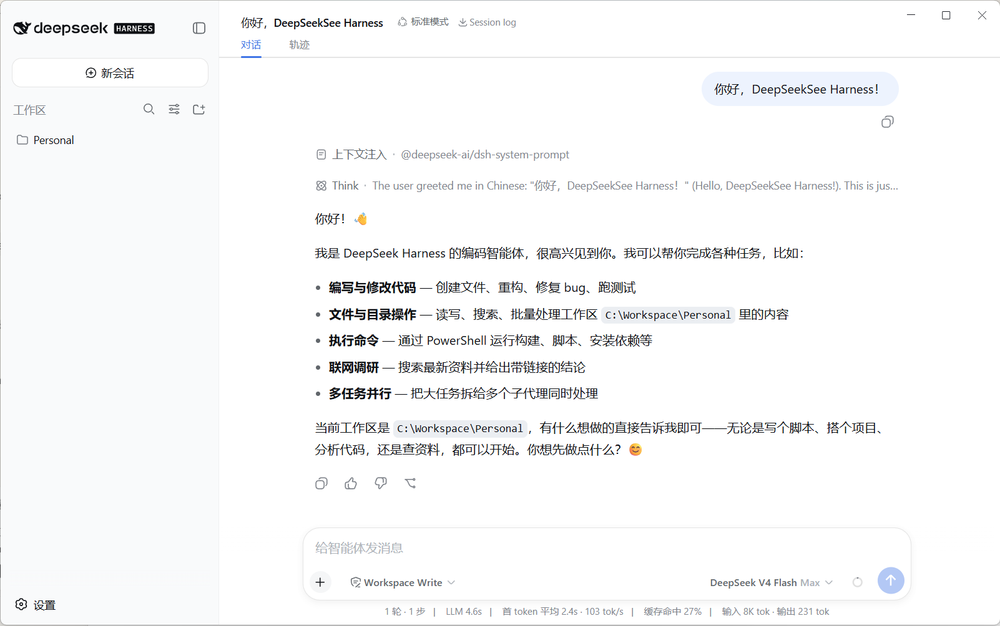
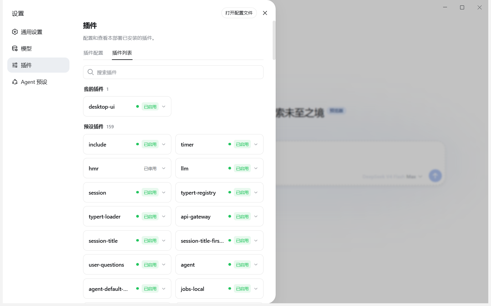

# DSH Desktop

> 一个面向 Windows 的非官方 [DeepSeek Harness](https://github.com/deepseek-ai/deepseek-harness) 桌面客户端。
> 不修改官方 DSH 源代码，直接运行并呈现官方 Web UI。

[](https://github.com/deepseek-ai/deepseek-harness)
[](https://github.com/CCMu04/DSHDesktop/releases)
[](LICENSE)





## 为什么做这个项目

DeepSeek Harness 原生提供 Web 界面，但日常使用仍需要在终端中启动和管理服务。DSH Desktop
把这套官方 Web UI 包装成可直接双击运行的桌面程序，同时保留原生 DSH 的配置、会话、插件和
工作区习惯。

## 主要优势

- **官方页面，零前端分叉**：直接加载官方 `dsh web`，界面和能力与对应版本的 DSH 保持一致。
- **无缝衔接原生 DSH**：默认共用 `~/.dsh`，设置、凭据、会话、Profiles 和插件可以直接互通。
- **无需全局安装 DSH**：安装包自带匹配版本的 DSH、官方 Node.js 运行时和 `pnpm` 工具链。
- **安静的后台终端**：在不破坏 Windows ACL 沙箱的前提下隐藏 PowerShell、Command Prompt 和
  `conhost` 窗口；Agent 的命令输出、退出码和文件操作仍可正常工作。
- **更轻的运行时升级**：官方运行时以压缩包交付，升级时复用未变化的依赖目录，只替换发生变化的
  包；相同版本不会重复解压。
- **跟随官方版本**：构建命令会查询 npm 上最新的 DSH 及配套组件，Dependabot 也会每周检查更新。
- **桌面体验优化**：原生窗口、简洁标题栏、合理的初始尺寸、单实例运行和外部链接安全打开。
- **可靠的原生打开**：配置文件与工作区目录由官方 opener 打开，子进程环境经过清洗，不会把
  后端 Node 环境泄漏给 VS Code 等 Electron 应用。
- **内置 desktop-ui**：首次使用或内置插件版本更新后的首次启动会安装并默认启用一次；此后不再
  修复或强制启用，用户的停用、启用或移除选择始终优先。
- **本地优先**：Web 服务只监听随机的本机回环端口，不对局域网暴露。

## 下载与安装

前往 [Releases](https://github.com/CCMu04/DSHDesktop/releases) 下载：

- [`DSH-Desktop-Setup-0.1.0-rc.6.5-x64.exe`](https://github.com/CCMu04/DSHDesktop/releases/download/v0.1.0-rc.6.5/DSH-Desktop-Setup-0.1.0-rc.6.5-x64.exe)：推荐，64 位标准安装包。
- [`DSH-Desktop-Portable-0.1.0-rc.6.5-x64.exe`](https://github.com/CCMu04/DSHDesktop/releases/download/v0.1.0-rc.6.5/DSH-Desktop-Portable-0.1.0-rc.6.5-x64.exe)：64 位免安装版。

支持 Windows 10/11 x64。首次启动需要展开约 300 MB 的官方运行组件，因此会比后续启动稍慢。

## 与原生 DSH 的数据关系

桌面端遵循官方 DSH Home 规则：

1. 如果设置了非空的 `DSH_HOME`，使用该目录。
2. 否则使用 `~/.dsh`。

因此将来安装官方 DSH 后，可以继续使用已有设置、会话和插件。用户创建的插件应放在
`~/.dsh/plugins`（或自己的项目目录）；Web Profile 的安装记录位于 `~/.dsh/profiles/web`。
这些目录都不属于桌面端可替换的运行时缓存。

内置 `desktop-ui` 的部署副本保存在应用数据目录，不覆盖 `~/.dsh/plugins` 中的同名开发目录。
桌面端按 DSH Home 和内置插件内容指纹记录一次性启用状态：首次部署或内置内容变化时通过官方
`dsh plugin` 命令安装并启用；指纹不变时，即使用户随后停用或移除，也不会再次干预。

## 更新机制

应用不会在每次启动时强制联网更新。发布新版时：

- `npm run dist` 会先同步 npm 上最新的 `@deepseek-ai/dsh` 及配套包，再进行打包。
- `npm run dist:offline` 只使用锁定版本，适合离线重建同一版本。
- 安装包生成 block map；运行时缓存按包增量替换，避免每次重新处理数万个文件。

## 本地构建

构建 x64 发布包要求 Windows 10/11 和 Node.js 22.19+ 或 24（构建机自带即可，目标机不需要）：

```powershell
git clone https://github.com/CCMu04/DSHDesktop.git
cd DSHDesktop
npm install
npm run dist
```

生成内容位于 `dist/`。如需复现锁定版本（`build/runtime/node-x64.exe` 已下载过时可离线完成）：

```powershell
npm ci
npm run dist:offline
```

## 工作原理

桌面壳启动官方 DSH Web 服务并将其加载到隔离的 Electron 窗口。后端运行在安装包内置的官方
Node.js 运行时中（DSH 的原生目录选择器依赖的 koffi 绑定与 node-pty 输出在 Electron-as-Node
下不可用，因此后端不能借用 Electron 进程）；桌面兼容层只调整 Windows 进程的窗口显示状态，
不取消控制台，也不绕过 DSH 的 ACL 沙箱。官方包在磁盘上保持原样。

设置页的配置文件打开请求与目录打开请求由官方 Host 原样处理：官方 opener（Windows
`Invoke-Item`）负责校验和打开，桌面端仅通过后端 preload 在派生 opener 子进程时清除
`ELECTRON_RUN_AS_NODE`/`NODE_OPTIONS`，避免这些变量污染 VS Code 等被打开的应用。不会修改
官方 Host 或 Web UI 源码。

## 安全与隐私

- 默认只监听 `127.0.0.1` 上的随机空闲端口。
- Electron 页面关闭 Node 集成并启用上下文隔离和沙箱。
- 非本地链接交给系统默认浏览器打开。
- 不上传或迁移用户的 DSH 配置、会话、凭据与插件。

## 声明

本项目是社区维护的非官方桌面封装，与 DeepSeek 无隶属或背书关系。DeepSeek、DeepSeek Harness
及相关标识归其权利人所有。官方 DSH 使用 MIT License；详见
[上游项目](https://github.com/deepseek-ai/deepseek-harness) 与 [第三方声明](THIRD_PARTY_NOTICES.md)。

本项目自身代码使用 [MIT License](LICENSE)。
